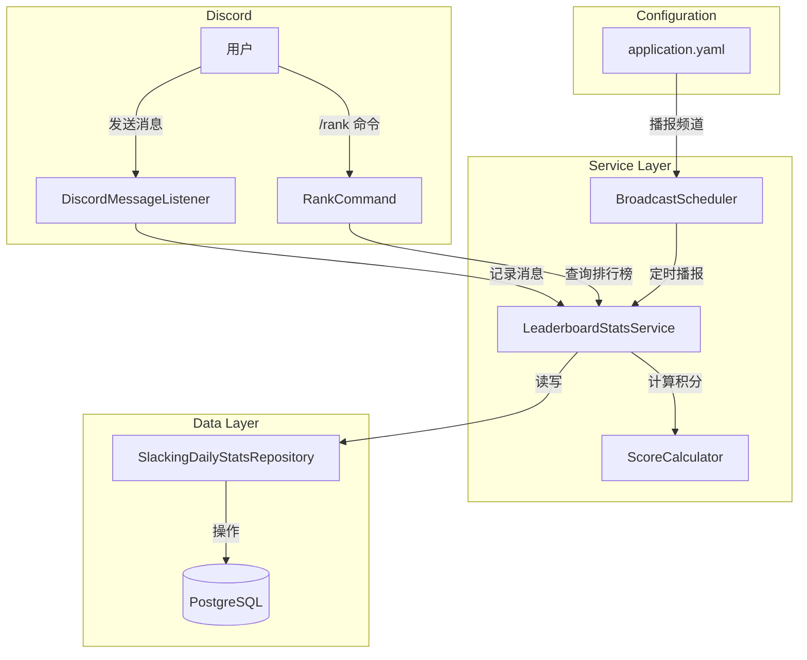

# Design Document: 摸鱼排行榜 (Slacking Leaderboard)

## Overview

本设计文档描述摸鱼排行榜功能的技术实现方案。该功能允许 Discord 用户通过 `/rank` 命令查看服务器内的摸鱼积分排行榜，支持日榜、周榜、月榜三种统计维度，并提供每日自动播报功能。

系统采用数据库表实时存储统计数据的方案，确保数据持久化和查询性能。积分计算考虑消息数量和内容长度，鼓励用户发送有质量的消息。

## Architecture



## Components and Interfaces

### 1. ScoreCalculator - 积分计算器

纯函数组件，负责根据消息内容计算摸鱼积分。

```java
@Component
public class ScoreCalculator {
    
    /**
     * 计算单条消息的摸鱼积分
     * @param content 消息内容
     * @return 积分值 (1-4分)
     */
    public int calculateScore(String content) {
        // 去除空白字符后计算长度
        int length = content.replaceAll("\\s+", "").length();
        
        int score = 1; // 基础积分
        if (length > 100) {
            score = 4;
        } else if (length > 50) {
            score = 3;
        } else if (length > 20) {
            score = 2;
        }
        return score;
    }
}
```

### 2. LeaderboardStatsService - 排行榜统计服务

核心服务组件，负责统计数据的更新和查询。

```java
@Service
public class LeaderboardStatsService {
    
    /**
     * 记录用户消息并更新统计
     */
    Mono<Void> recordMessage(String guildId, String userId, String userName, String content);
    
    /**
     * 获取日榜排行
     */
    Flux<LeaderboardEntry> getDailyLeaderboard(String guildId, LocalDate date, int limit);
    
    /**
     * 获取周榜排行
     */
    Flux<LeaderboardEntry> getWeeklyLeaderboard(String guildId, LocalDate weekStart, int limit);
    
    /**
     * 获取月榜排行
     */
    Flux<LeaderboardEntry> getMonthlyLeaderboard(String guildId, int year, int month, int limit);
    
    /**
     * 获取用户个人统计
     */
    Mono<UserStats> getUserStats(String guildId, String userId);
    
    /**
     * 获取用户在指定排行榜中的排名
     */
    Mono<Integer> getUserRank(String guildId, String userId, String period);
}
```

### 3. RankCommand - 排行榜命令

统一命令实现，支持 Slash 命令和传统消息命令。

```java
@Component
public class RankCommand implements UnifiedCommand {
    
    // Slash 命令: /rank [period] 
    // period: day(默认), week, month, me
    
    @Override
    public CommandData buildCommandData() {
        return Commands.slash("rank", "查看摸鱼排行榜")
            .addOption(OptionType.STRING, "period", "统计周期: day/week/month/me", false);
    }
}
```

### 4. BroadcastScheduler - 播报调度器

定时任务组件，负责每日摸鱼王播报。

```java
@Component
public class BroadcastScheduler {
    
    /**
     * 每天 5:30 执行播报
     */
    @Scheduled(cron = "0 30 5 * * ?")
    public void broadcastDailyWinner();
}
```

## Data Models

### SlackingDailyStats - 每日统计实体

```java
@Data
@Builder
@Table("slacking_daily_stats")
public class SlackingDailyStats {
    @Id
    private Long id;
    
    @Column("guild_id")
    private String guildId;
    
    @Column("user_id")
    private String userId;
    
    @Column("user_name")
    private String userName;
    
    @Column("stat_date")
    private LocalDate statDate;
    
    @Column("message_count")
    private Integer messageCount;
    
    @Column("total_score")
    private Integer totalScore;
    
    @Column("created_at")
    private LocalDateTime createdAt;
    
    @Column("updated_at")
    private LocalDateTime updatedAt;
}
```

### LeaderboardEntry - 排行榜条目 DTO

```java
@Data
@Builder
public class LeaderboardEntry {
    private int rank;
    private String userId;
    private String userName;
    private int messageCount;
    private int totalScore;
}
```

### UserStats - 用户统计 DTO

```java
@Data
@Builder
public class UserStats {
    private String userId;
    private String userName;
    
    private int todayScore;
    private int todayMessageCount;
    private int todayRank;
    
    private int weekScore;
    private int weekRank;
    
    private int monthScore;
    private int monthRank;
}
```

### 数据库表 DDL

```sql
CREATE TABLE slacking_daily_stats (
    id BIGSERIAL PRIMARY KEY,
    guild_id VARCHAR(64) NOT NULL,
    user_id VARCHAR(64) NOT NULL,
    user_name VARCHAR(128),
    stat_date DATE NOT NULL,
    message_count INTEGER DEFAULT 0,
    total_score INTEGER DEFAULT 0,
    created_at TIMESTAMP DEFAULT CURRENT_TIMESTAMP,
    updated_at TIMESTAMP DEFAULT CURRENT_TIMESTAMP
);

COMMENT ON TABLE slacking_daily_stats IS '摸鱼排行榜每日统计';
COMMENT ON COLUMN slacking_daily_stats.guild_id IS 'Discord 服务器 ID';
COMMENT ON COLUMN slacking_daily_stats.user_id IS '用户 ID';
COMMENT ON COLUMN slacking_daily_stats.user_name IS '用户名';
COMMENT ON COLUMN slacking_daily_stats.stat_date IS '统计日期';
COMMENT ON COLUMN slacking_daily_stats.message_count IS '消息数量';
COMMENT ON COLUMN slacking_daily_stats.total_score IS '总积分';

-- 索引优化查询性能
CREATE INDEX idx_slacking_stats_guild_date ON slacking_daily_stats(guild_id, stat_date);
CREATE INDEX idx_slacking_stats_guild_user ON slacking_daily_stats(guild_id, user_id);
CREATE UNIQUE INDEX idx_slacking_stats_unique ON slacking_daily_stats(guild_id, user_id, stat_date);
```

## Correctness Properties

*A property is a characteristic or behavior that should hold true across all valid executions of a system-essentially, a formal statement about what the system should do. Properties serve as the bridge between human-readable specifications and machine-verifiable correctness guarantees.*

### Property 1: 积分计算正确性

*For any* 消息内容字符串，积分计算结果应满足以下规则：
- 去除空白字符后长度 ≤ 20：积分 = 1
- 去除空白字符后长度 > 20 且 ≤ 50：积分 = 2
- 去除空白字符后长度 > 50 且 ≤ 100：积分 = 3
- 去除空白字符后长度 > 100：积分 = 4

**Validates: Requirements 1.1, 1.2, 1.3, 1.4, 1.5**

### Property 2: 排行榜排序正确性

*For any* 用户积分数据集合，排行榜结果应满足：
- 按总积分降序排列
- 相同积分时按消息数降序排列
- 结果数量不超过指定的 limit 值

**Validates: Requirements 3.5**

### Property 3: 周/月统计汇总正确性

*For any* 时间范围（周或月），汇总结果应等于该范围内所有每日统计数据的总和：
- 周榜：本周一至今的每日积分之和
- 月榜：本月 1 日至今的每日积分之和

**Validates: Requirements 4.6, 4.7**

### Property 4: 统计数据累加正确性

*For any* 用户在同一天发送的多条消息，统计记录应满足：
- message_count = 该用户当天发送的消息总数
- total_score = 该用户当天所有消息积分之和

**Validates: Requirements 2.3, 2.4**

## Error Handling

| 场景 | 处理方式 |
|------|----------|
| 数据库连接失败 | 记录错误日志，返回友好提示"服务暂时不可用" |
| 排行榜数据为空 | 显示"暂无数据，快来发消息摸鱼吧！" |
| 用户不在排行榜中 | 显示"你还没有摸鱼记录哦" |
| 播报频道不存在 | 记录警告日志，跳过该服务器的播报 |
| 定时任务执行异常 | 记录错误日志，不影响下次执行 |

## Testing Strategy

### 单元测试

使用 JUnit 5 + Mockito 框架，覆盖以下核心逻辑：

1. **ScoreCalculator 测试**
   - 测试各长度区间的积分计算（0-20、21-50、51-100、100+ 字符）
   - 测试空白字符处理（空格、制表符、换行符）
   - 测试边界值（正好 20、50、100 字符）
   - 测试空字符串和纯空白字符串

2. **LeaderboardStatsService 测试**
   - 测试排行榜排序逻辑（按积分降序）
   - 测试周/月日期范围计算
   - 测试用户排名查找
   - 测试数据累加逻辑

3. **格式化输出测试**
   - 测试排行榜 Embed 格式生成
   - 测试奖牌 emoji 分配（🥇🥈🥉）
   - 测试播报消息格式

### 测试配置

- 使用 `@ExtendWith(MockitoExtension.class)` 启用 Mockito
- 使用 `reactor-test` 的 `StepVerifier` 测试响应式流
- 测试类命名规范：`{ClassName}Test.java`
